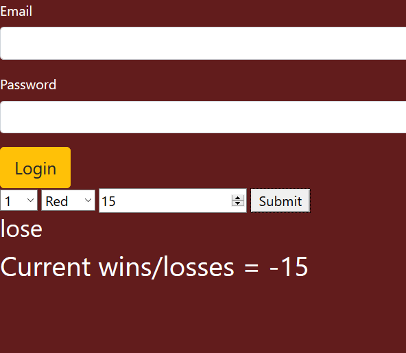

### Casino-Roulette
## Goal: Create an app that lets a user bet on a number and a color, if they guess right they will double their bet, if they guess wrong they will lose their bet. The casino owner should be able to log in and be able to see the total losses and winnings of the patrons as well as the number of games played and their results

# How it's made:
- Server is set up to route traffic as well as render ejs, html, css, and browser-side javascript
- Simple algorithm is used to randomly determine a win or loss from the main page
- Either result ends up triggering a put request which will modify 4 tracking variables in the database which store info on the number of games and their outcomes
- Logging in is a post request to the server, the server uses passport to authenticate a login, only one account is able to be logged into (email: bossman@yahoo.com, password:212121)
- The profile page that renders takes information from the 4 variables and displays it for the owner to see
